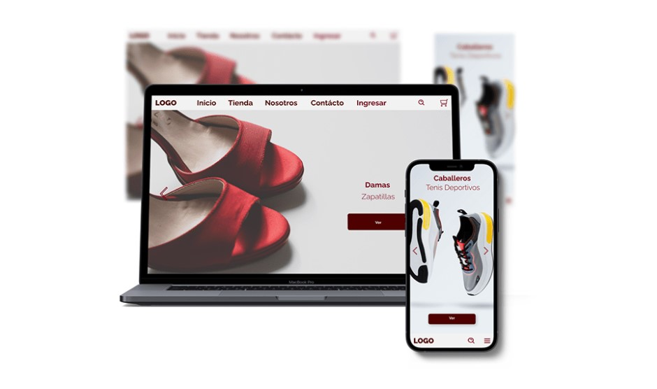

### Screenshot

### Links

- Diseño Frontend: [Binance](https://www.behance.net/gallery/130292939/Diseno-frontend-responsivo)

## Objetivo
- Desarrollar un portal web, con base de datos y carrito de compra
para una comercializadora de zapatos.

### Tareas realizadas
- Diseño de la maquetación en Figma.
- Diseño y desarrollo de la base de datos en Mysql.
- Desarrollo Frontend con HTML, CSS, Javascript y Bootstrap.
- Desarrollo Backend con PHP7.
- Implementación de la API de PayPal.

### Descripción detallada de actividades
- La creación de portal para la comercializadora de zapatos, se divide con cinco
fases.
- Planificación del plan de trabajo
  - Definición del plan de trabajo.
- Análisis
  - Análisis de requerimientos.
- Diseño
  - Desarrollo de la identidad de la empresa.
  - Elaboración de la maquetación.
  - Diseño de la base de datos.
  - Diseño de las vistas y formularios.
- Desarrollo
  - Configuración el entorno de desarrollo.
  - Estructura del patrón de diseño.
  - Configuración del template administrativo.
  - Desarrollo del CRUD para el módulo de roles, usuarios, clientes, proveedores, categorías
  - Desarrollo de los módulos de permisos, usuarios, clientes, proveedores, categorías, productos y pedidos.
  - Desarrollo del sistema de login.
  - Desarrollo del carrito de compras.
  - Desarrollo de pasarela de pagos.
- Pruebas
  - Ejecución de pruebas a nivel local y en servidor web.

## Autor
- GitHub - [ifdotcom](https://github.com/ifdotcom)

